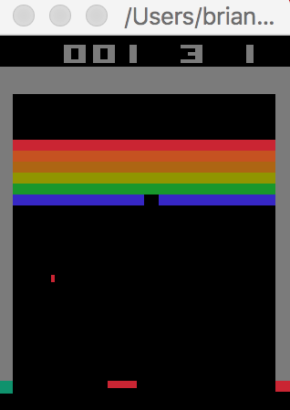

## 개발 환경 설정 2: 맥 OS

맥 OS에는 기본적으로 파이썬 2.7버전이 설치되어있기 때문에 3.5 버전을 새로 설치를 해야 합니다.

### 1.1 파이썬 3.5 설치 및 환경 설정

파이썬 다운로드 페이지[[Link]](https://www.python.org/downloads/release/python-350/)로 접속하면 다음과 같은 화면이 나옵니다.

   <p align="center"></p>


1. 위 화면에서 자신의 맥 OS 버전에 맞는 파일을 선택해서 다운로드합니다. 다운로드가 완료된 파일을 실행 후 안내에 따르면 설치가 완료됩니다.

   ​

   <p align="center"></p>

   ​

2. 파이썬 설치가 정상적으로 완료됐는지 확인하기 위해서는 터미널을 실행합니다. 터미널 창에 ‘python3’ 명령어를 입력했을 때 다음 화면과 같이 출력된다면 정상적으로 설치된 것입니다.

   ​

   <p alien="center"></p>

   ​

### 1.2 파이참 커뮤니티 설치 및 환경 설정

파이참의 설치 및 환경 설정은 다음과 같은 순서로 진행합니다. 

1. 파이참 홈페이지[[Link]](https://www.jetbrains.com/pycharm/)에 접속하여 커뮤니티버전을 다운로드합니다. 

2. 다운로드가 완료된 파일을 실행하고아래 그림에서 왼쪽 PyCharm CE 아이콘을 오른쪽 폴더 아이콘으로 드래그하면 설치가 완료됩니다.

   <p align="center"></p>

3. 처음 파이참을 실행하게 되면 설정화면이 나오는데 IDE theme을 통해 IDE의 색상과 스타일을 변경할 수 있습니다. Default는 우분투의 개발환경설정에서 봤던 Intellij 테마입니다. 이 책에서는 Default를 사용할 것입니다.
   ​

4. 초기 설정을 완료하고 Create New Project 버튼을 클릭합니다.

   ​

5. Create New Project 버튼을 클릭하면 아래 그림과 같은 화면이 나옵니다. Location은 프로젝트가 생성될 경로와 프로젝트 폴더명을 설정하는 곳입니다. 프로젝트의 이름과 경로는 독자가 임의로 지정하면 됩니다.

   Interpreter는 프로젝트에서 어떤 파이썬 Interpreter를 사용할 것인지 고르는 것입니다. 우분투에서와 마찬가지로 VirtualEnv를 통해 가상 환경을 만들고 그것을 Interpreter로 사용할 것입니다. Create VirtualEnv 버튼을 누릅니다.

   ​

   <p align="center"></p>

   ​

6. 아래 그림은 VirtualEnv의 생성화면입니다. Name과 Location은 여러분이 임의로 설정하면 됩니다. Base Interpreter는 위와 같이 새로 설치한 python3.5 를 선택합니다. OK버튼을 누르면 해당 VirtualEnv가 생성됩니다.

   ​

   <p align="center"></p>

   ​

7. 처음 New Project 생성화면의 Interpreter에서 방금 생성한 VirtualEnv를 선택해줍니다. 그리고 Create버튼을 누르면 프로젝트 생성이 완료됩니다.

   ​

   <p align="center"></p>

   ​

8. 프로젝트를 생성하고 나면 다음과 같은 작업 환경이 보입니다. 이 화면에서 최상위 폴더를 우클릭한 후 

   New -> Python File을 클릭하면 새로운 파이썬 파일을 생성할 수 있습니다. 

   ​

   <p align="center"></p>

   ​

9. 파이참이 제대로 설치됐는지 확인하기 위해 hello world 예제를 실행해봅니다. 우분투에서와 동일하기 때문에 생략하겠습니다.

   ​

### 1.3 오픈에이아이 설치

2016년에 오픈에이아이(OpenAI)라는 회사가 세워졌습니다. 이 회사의 목표는 인공지능 기술을 전 세계에공개해서 더 안전한 인공지능을 만들어가며 더 많은 분야에 인공지능을 도입하는 것입니다. 오픈에이아이 짐(Gym)는 오픈에이아이에서 만든 환경인데여기서 여러가지 인공지능 알고리즘을 테스트 해볼 수 있습니다. 

오픈에이아이짐의 코드는 모두 오픈에이아이의 깃허브(Github)[[Link]](https://github.com/openai/gym)에업로드되어있습니다.

   <p align="center"></p>


오픈에이아이 짐의 설치는 공식 홈페이지에 설명되어있습니다. 오픈에이아이짐을 설치하기 위해서는 깃(Git)를 먼저 설치해줘야 합니다. 깃(Git)은 버전 관리 도구로서개발 프로세스에서 버전 관리가 필요할 때 주로 사용합니다. 오픈에이아이는 오픈소스로 깃헙(Github)에 공개되어 있습니다. 깃헙은 버전관리되는 소스 코드들의원격 저장소 역할을 하는 플랫폼입니다.   

다음과 같은 명령어로 깃를 설치합니다.

```shell
$ sudo apt-get install git
```


깃을 설치한 다음에 오픈에이아이 짐을 설치합니다. 터미널 창에서 오픈에이아이 짐을 설치할 디렉토리로 이동한 다음에 다음과 같은 명령어를 실행합니다. 

```shell
$ git clone https://github.com/openai/gym
$ cd gym
$ pip3 install -e .
```


오픈에이아이 짐은 여러가지 다른 설정으로 설치할 수 있는데 pip install -e .은 가장 기본적인 부분들만 설치하는 것입니다. 이후에 아타리 게임 등 오픈에이아이 짐의 모든 게임들을 사용하려면 pip install -e . 대신에 다음과 같이 입력해야 합니다.

``` shell
$ pip3 install -e .[all]
```


### 1.4 예제 테스트

### 1.4.1 카트폴

오픈에이아이 짐이 정상적으로 설치되었는지 확인하기 위해서 간단한 예제를 실행해봅니다. 오픈에이아이 짐의 가장 간단한 예제는 카트폴(CartPole)입니다. 카트폴은 카트에 진자가 달린 형태로 이 문제의 목표는 카트를 움직여서 그 반동으로 진자를 세우는 것입니다. 테스트할 때는 그냥 아무 입력도 카트폴에 주지 않은 상태로 오픈에이아이 짐이 제대로 실행되는지만 확인할 것입니다. 

`CartPole.py` 파일을 생성하고 아래와 같이 입력합니다.

```python
import gym
env = gym.make('CartPole-v0')
env.reset()
for _ in range(1000):
    env.render()
    env.step(env.action_space.sample()) # take a random action
```

​         					        	              카트폴 예제 실행 코드

이 코드를 실행하면 화면에 아무 행동도 하지 않는 카트폴이 실행됩니다. 오픈에이아이 짐은 이와 같은 많은 문제들을 제공하며 사용자들은 오픈에이아이 짐의 여러가지 문제에 자신의 학습 알고리즘을 적용해볼 수 있습니다. 또한 오픈에이아이 짐 사이트에 자신의 알고리즘을 공유하거나 결과를 확인할 수 있습니다. 


   <p align="center"></p>


### 1.4.2 아타리 브레이크아웃

위에서 오픈에이아이를 전체 설치 했기 때문에 아타리 브레이크 아웃 예제를 테스트 해볼 수 있습니다.

브레이크 아웃을 테스트 하기 위한 테스트는 rlcode 깃헙 레포지토리에 있는 ``3-atari/1-breakout/breakout_dqn.py`` 예제를 사용하겠습니다. 

우선 해당 파이썬 코드가 있는 디렉토리로 이동합니다.

```shell
$cd 3-atari/1-breakout
```

``breakout_dqn.py`` 코드는 카트폴 테스트 예제에 비해  코드량이 많으므로 전체는 생략하겠습니다.

다음 명령어로 ``breakout_dqn.py`` 를 실행합니다.

```shell
$python breakout_dqn.py
```

dqn알고리즘을 실행하기 때문에 컴퓨터 사양에 따라 렌더링되는 시간이 다를 수 있습니다.

아래 그림은 실행화면 입니다.

  <p align="center"></p>
