## 윈도우 설치(윈도우 10 권장)

현재 Open ai gym에서 공식 github의 issue[[link]](https://github.com/openai/gym/issues/11) 에 따르면 Openai gym은 공식적으로 윈도우 환경에 대한 설치를 제공하고 있지 않습니다.

그래서 윈도우 사용자는 우분투와 맥 운영체제와 달리 아타리 브레이크 아웃을 실행시키기 위한 추가 환경 설치를 해야합니다.

윈도우에서 책에 있는 예제를 실행시키기 위해 다음 항목들을 필요로 합니다.

- python 3.5
- Numpy, scipy
- Pycharm(IDE)
- Git
- Open ai Gym
- atari.py(github에서 설치)
- MSYS2
- Xming

### 1. 파이썬 설치

- 파이썬은 공식 홈페이지[[link]](https://www.python.org/downloads/windows/)에서 다운로드 할 수 있습니다. 3.5버전의 64bit 설치를 권장합니다.

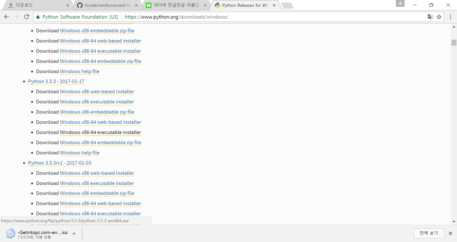

- 파이썬 인스톨러 실행 화면입니다.

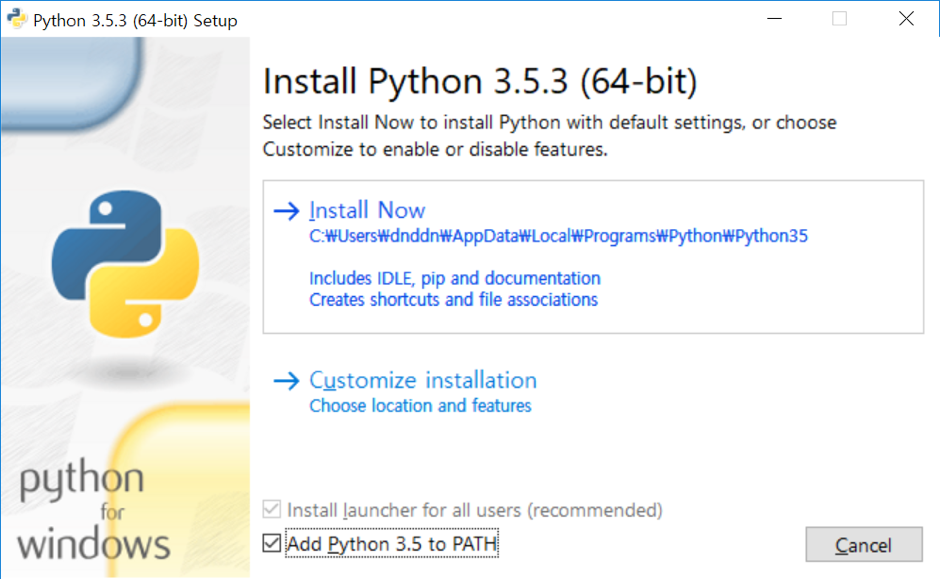


### 2. Numpy, spicy 설치

- Numpy, scipy는 바이너리 파일을 다운로드하여 pip (파이썬 패키지 관리자)를 이용해 설치합니다. 바이너리 파일은 다음 링크에서 다운로드 할 수 있습니다. 

  링크 : [http://www.lfd.uci.edu/~gohlke/pythonlibs/](http://www.lfd.uci.edu/~gohlke/pythonlibs/)

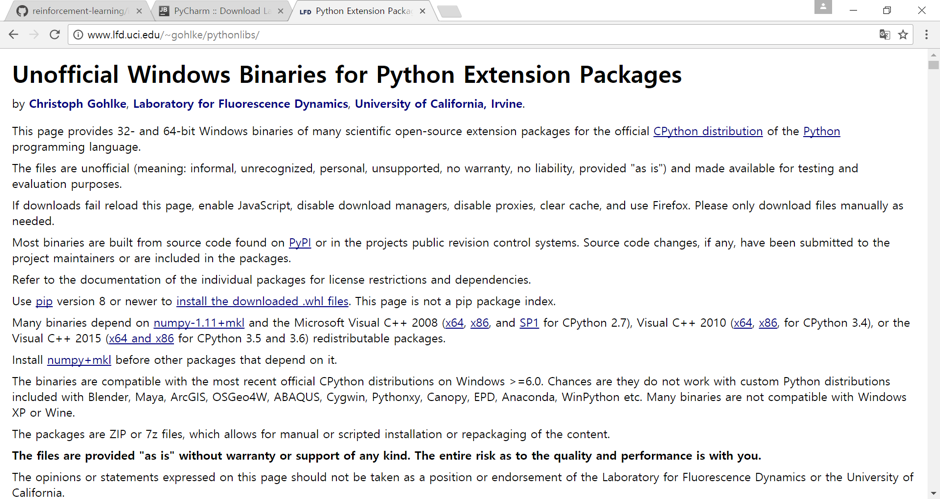

- 바이너리 파일(확장자 whl)을 윈도우 명령어창(cmd)에서 pip를 통해 설치합니다.

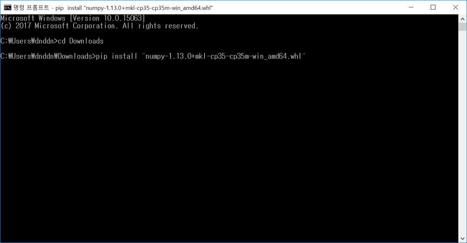


### 3. 파이참 설치

- 파이썬을 좀 더 편리하게 사용하기 위해 IDE(interface development environment)사용을 권장합니다. 파이참은 공식 홈페이지에서 다운로드하여 설치할 수 있습니다. [[link](https://www.jetbrains.com/pycharm/download/#section=windows)]

- 파이참 설치 화면 입니다.

   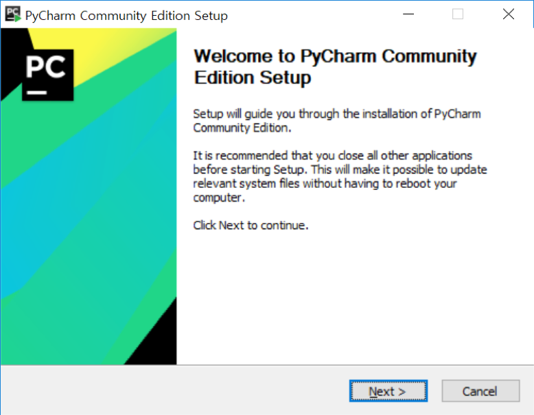

   ​

- 프로젝트 생성 화면입니다. 파이참에서 기본으로 제공하는 PycharmProjects 디렉토리에 rl_book이라는 이름으로 프로젝트를 생성하겠습니다.

   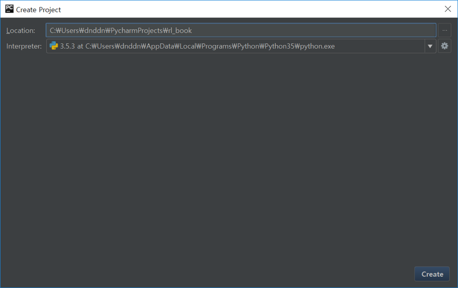

   ​

- rl_book 프로젝트가 생성되었습니다.

  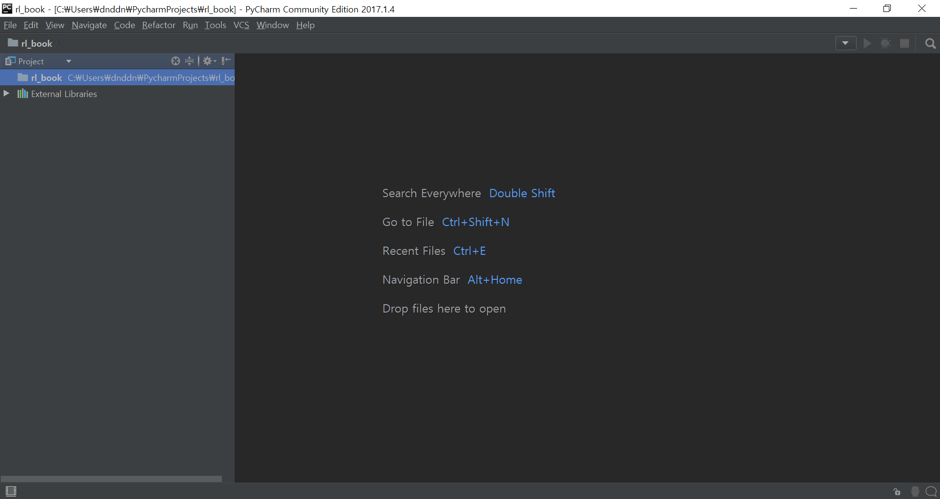

  ​

- <옵션 설정> 

  settings에서 파이참의 다양한 설정을 할 수 있습니다.

  현재 파이참 테마는 Darcula로 설정되어있습니다. 사용자에 따라 원하는 테마를 설정할 수 있습니다.
  
  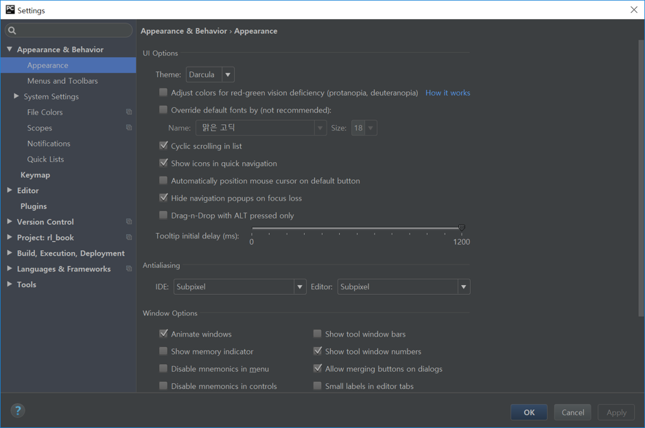

  ​

- Setting 왼쪽의 Project : rl_book(프로젝트 명)을 클릭하면 현재 프로젝트의 파이썬 버전과 인터프리터를 설정할 수 있습니다. virtualenv(가상환경)을 생성할 수 있고 현재 프로젝트에 설치된 파이썬 패키지들의 버전들을 확인 할 수 있습니다.

   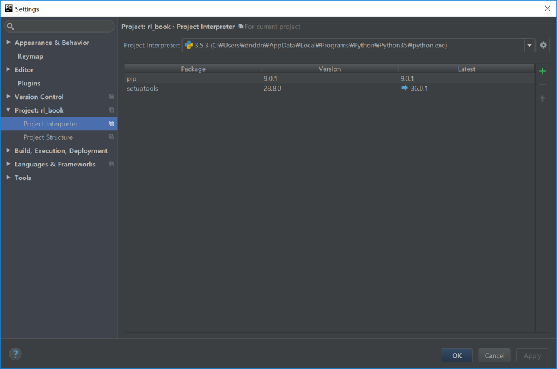


### 4. Git 설치

- Openai gym과 윈도우 환경에서 openai gym설치 시 카트폴은 기본적인 패키지 설치로 실행이 가능하지만 아타리 브레이크 아웃은 별도로 설치를 해줘야 합니다. 아타라 브레이크아웃은 Github 저장소에서 다운로드하여 설치해야 하므로 Git을 설치해야 합니다.  
  - 링크 : https://git-scm.com/download
  
     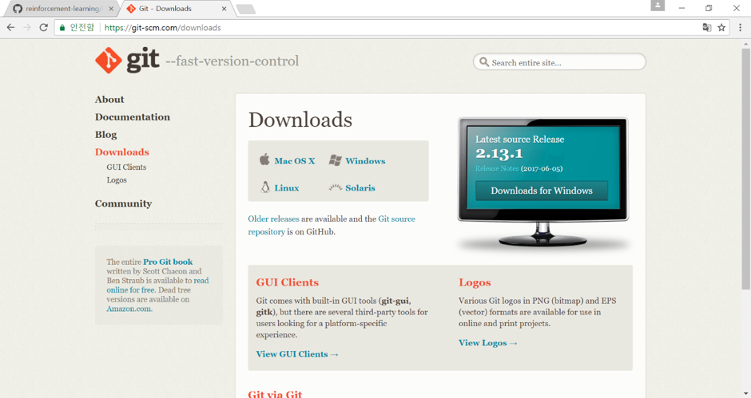

  ​

- Git 설치 화면입니다. Git 설치가 완료되면 뒤에서 설치할 Openai gym과 atari.py등을 다운로드 할 수 있습니다.

    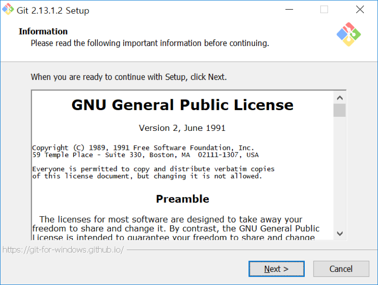

### 5. Openai Gym 설치

- 우선, Openai gym의  Github 레포지토리에서 다운로드 받습니다.

  Github 레포지토리에서 다운로드하기 위해 윈도우 명령 프롬프트 창에서 실행하거나, Git bash 둘중에 아무거나 이용하셔도 됩니다. 여기서는 명령 프롬프트를 이용해 진행하겠습니다.

  ```shell
  git clone https://github.com/openai/gym
  ```

  설치 화면 입니다.

  


- Github 저장소를 다운로드 하였으면 해당 디렉토리로 이동하여 설치를 진행합니다.

  ```shell
  cd gym
  pip install -e .
  ```

  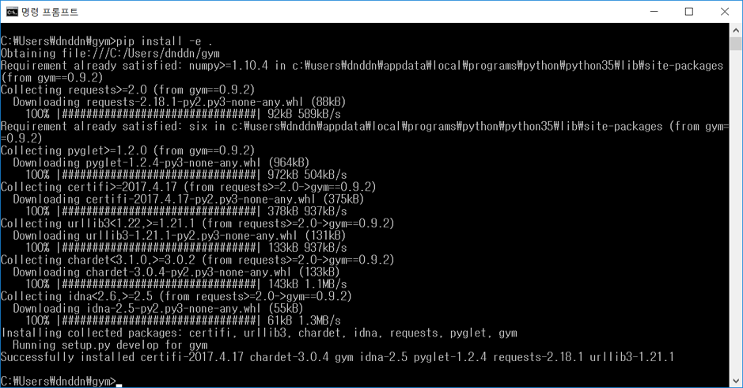


- Openai gym을 설치한 후 파이참을 이용해 카트폴을 실행해보겠습니다.

  카트폴을 간단히 실행하기 위한 코드입니다.

  ```python
  import gym
  env = gym.make('CartPole-v0')
  env.reset()
  for _ in range(1000):
      env.render()
      env.step(env.action_space.sample())
  ```

  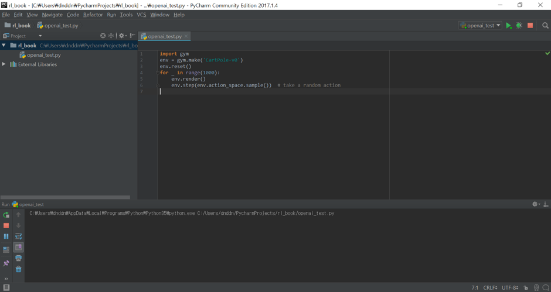


- 카트폴을 실행 성공 하였을 때의 화면입니다.

  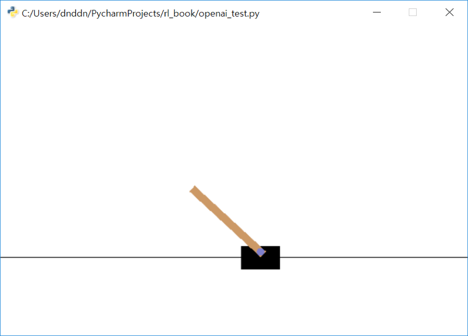

  ​

### 6. MSYS2 설치

- 아타리 브레이크아웃을 실행시키기 위해 MSYS2를 설치해야 합니다.

  MSYS2는 윈도우 환경에서 GNU 툴을 이용하기 위한 최소한의 환경을 의미합니다. 

  자세한 설명은 다음 링크를 참조하시면 됩니다. [[link]](http://klutzy.nanabi.org/blog/2015/03/05/mingw/)

  - 다운로드 링크 : http://www.msys2.org/


  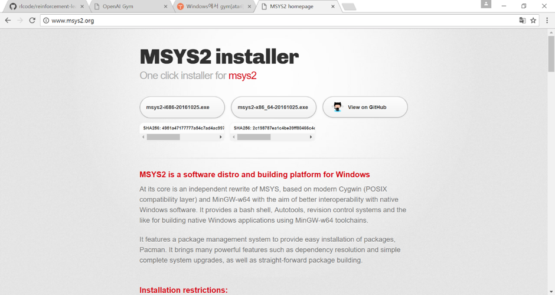


- 설치 화면 입니다.

  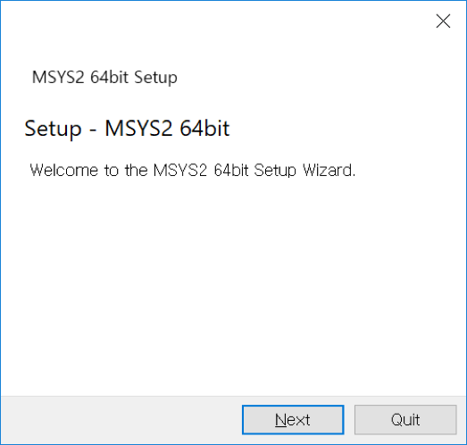


- MSYS2를 설치하고 MSYS2 터미널을 실행합니다. 

  터미널에서 다음 명령어를 실행합니다.

  ```shell
  $ pacman -S base-devel mingw-w64-x86_64-gcc mingw-w64-x86_64-cmake
  ```

  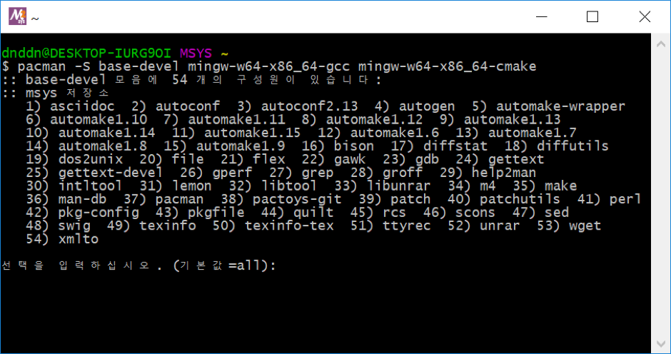

  ​

- 선택 입력 단계가 나오면 아무 입력을 하지 않고 엔터를 치고 실행하시면 됩니다.

  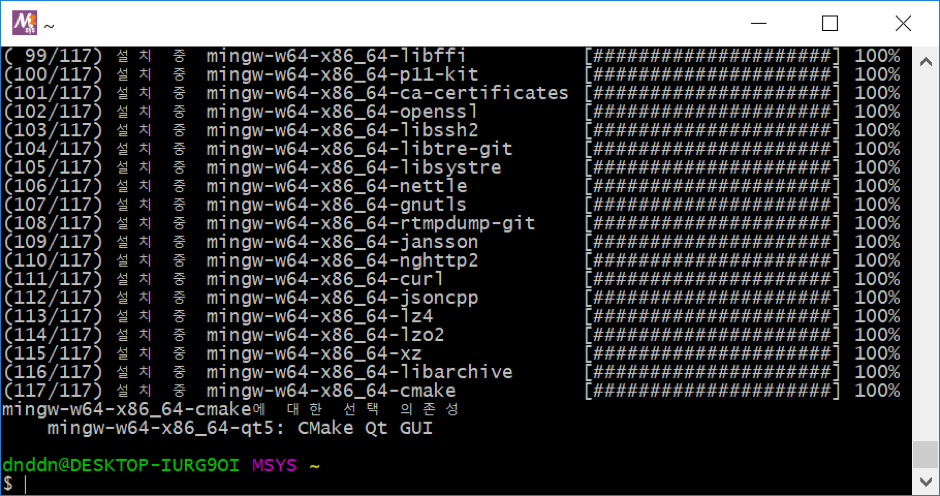


### 7. 내컴퓨터 환경설정

- 환경변수를 추가 해야 합니다.

  1. <내컴퓨터> 오른쪽 클릭
  2. <시스템 속성> 선택
  3. <고급 탭> 이동
  4. <환경 변수> 클릭

  <p align="center">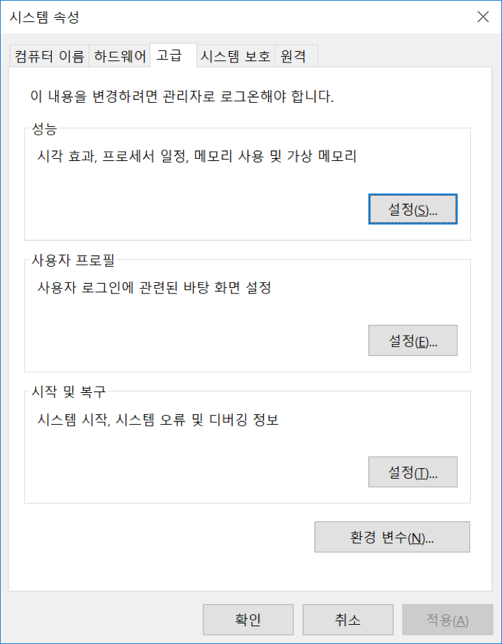</p>


- 환경변수 창 화면입니다.

  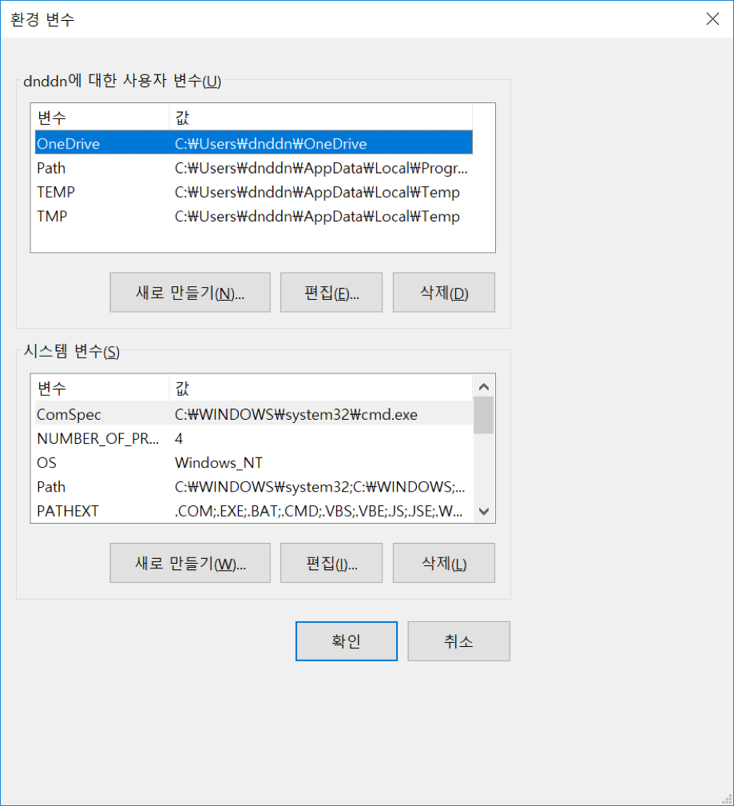


- <시스템 변수>에서 <새로 만들기>를 클릭 합니다.

  <변수 이름>과 <변수 값>에 다음 값을 입력합니다.

  - 변수 이름 : ``DISPLAY``
  - 변수 값 : ``:0``

  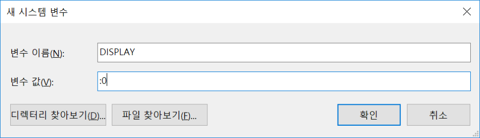


- 그리고 한번 더 <새로 만들기>를 클릭합니다.

  - 변수 이름 : ``PYTHONPATH``

  - 변수 값 : ``C:\path\to\atari.py:$PYTHONPATH``

    변수 값에 atari.py가 설치한 경로를 넣으면 됩니다.

  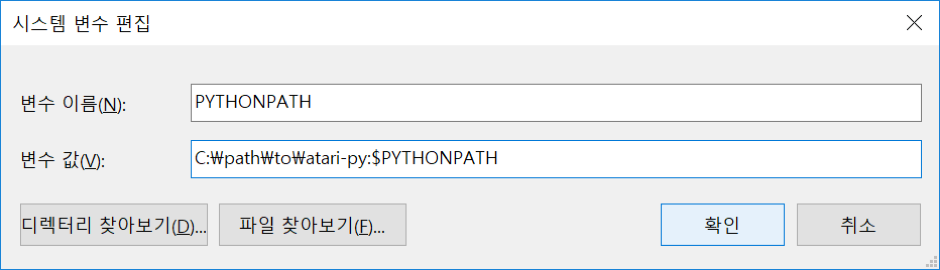


- <시스템 변수>에서 Path 변수에 MSYS2를 추가합니다.

  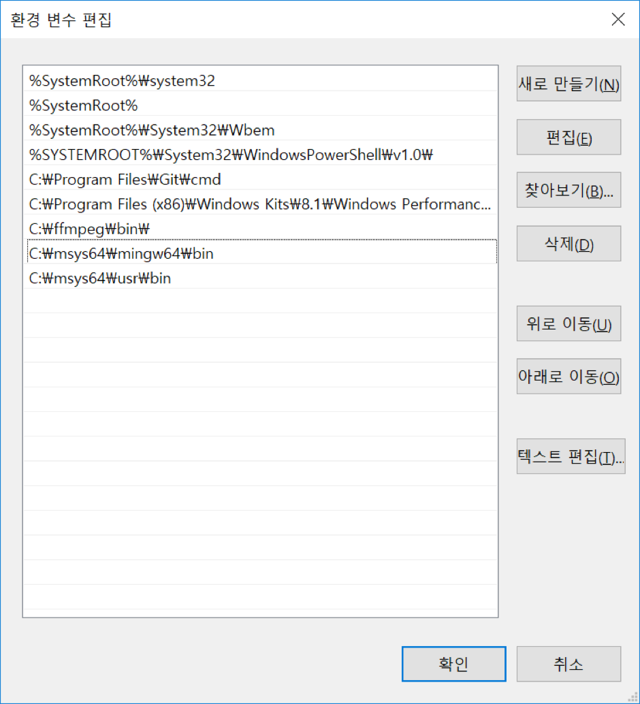


### 8. Xming 설치

- 다음 경로에서 다운로드 합니다.

  - 링크 : https://sourceforge.net/projects/xming/?source=directory

  Xming  설치화면 입니다.

  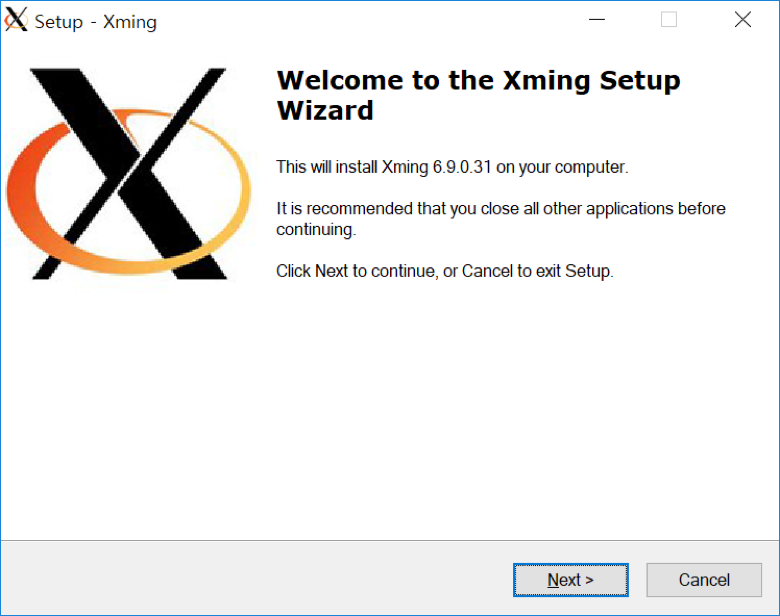


### 9. atari.py 설치

- 아타리 브레이크 아웃을 별도로 설치해줘야 합니다. Github 레포지토리에서 다운로드하여 설치합니다.\

  ```shell
  git clone https://github.com/rybskej/atari-py
  ```

  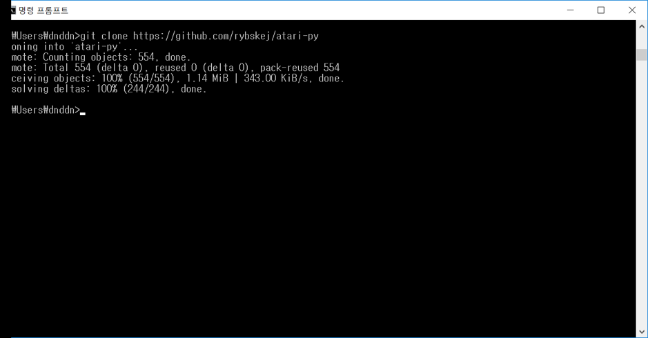


- atari.py가 설치된 디렉토리로 이동하고 make 명령어를 실행합니다.

  make실행이 안되면 명령 프롬프트 창을 설치하고 다시 시도합니다.

  ```shell
  cd atari-py
  make
  ```

  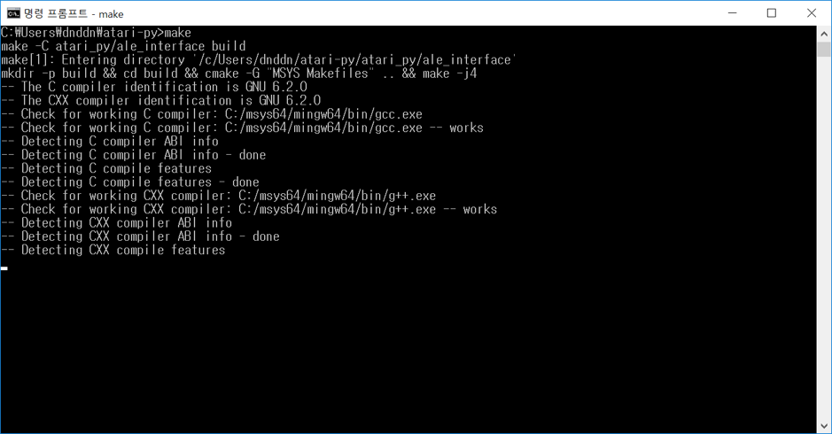
   

- make 실행 화면입니다.

  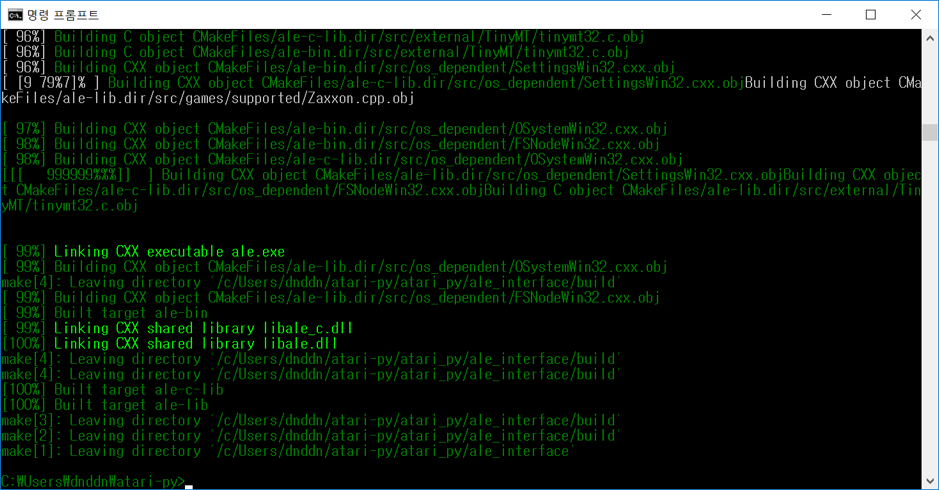


- make가 실행이 완료되면 다음 명령어로  setup.py를 실행합니다.

  ```shell
  python setup.py install
  ```

  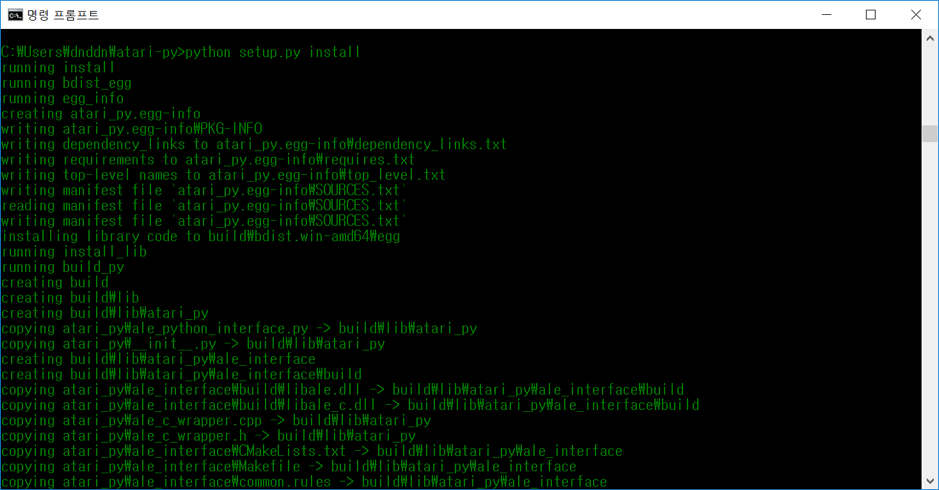

  ​

  setup.py 설치 화면 입니다.

  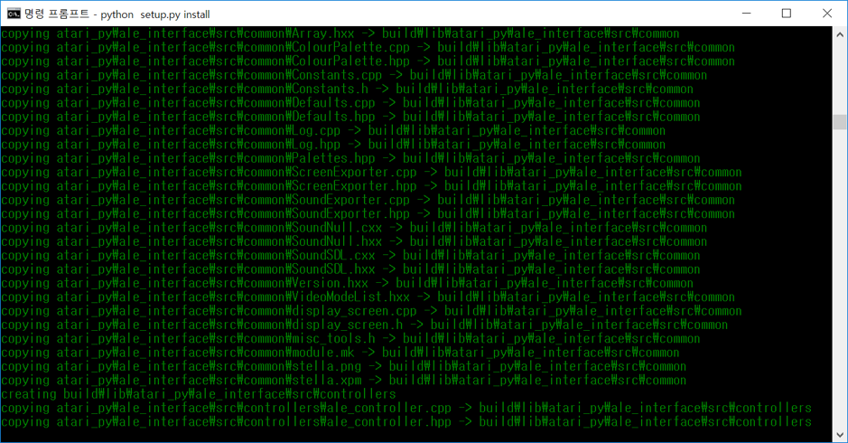


- 다음 명령어로 atari.py를 설치 합니다.

  ```shell
  $pip install -U git+https://github.com/Kojoley/atari-py.git 
  ```

  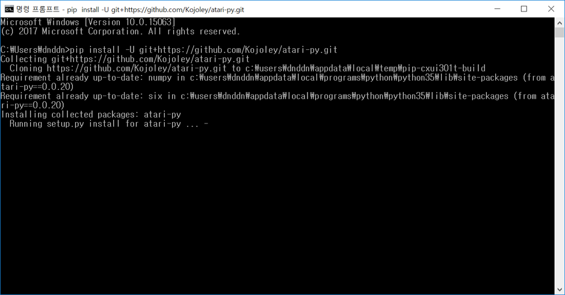


### 10. 텐서플로우, 케라스, scikit-image, h5py 등 라이브러리 설치

- 책 예제를 GIthub 레포지토리에서 다운로드 받은 후 아래 명령어로 설치합니다.

  - Github 레포지토리 : https://github.com/rlcode/reinforcement-learning-kr

  ```shell
  pip install -r requirement.txt
  ```

### 11. breakout_dqn.py 실행

- ``reinforcement-learning-kr/3-atari/1-breakout`` 경로에 있는 ``breakout_dqn.py``를 실행합니다.

  ```python
  python breakout_dqn.py
  ```

  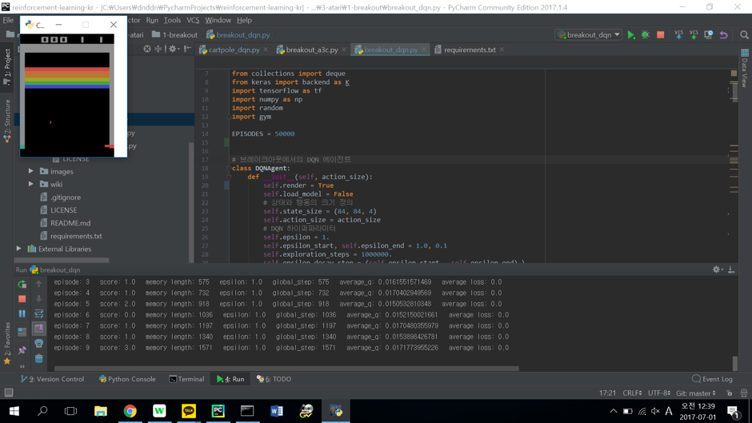


- 아타리 브레이크 아웃 실행화면 입니다.

  <p align="center">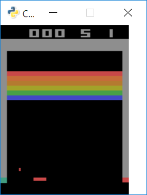</p>
